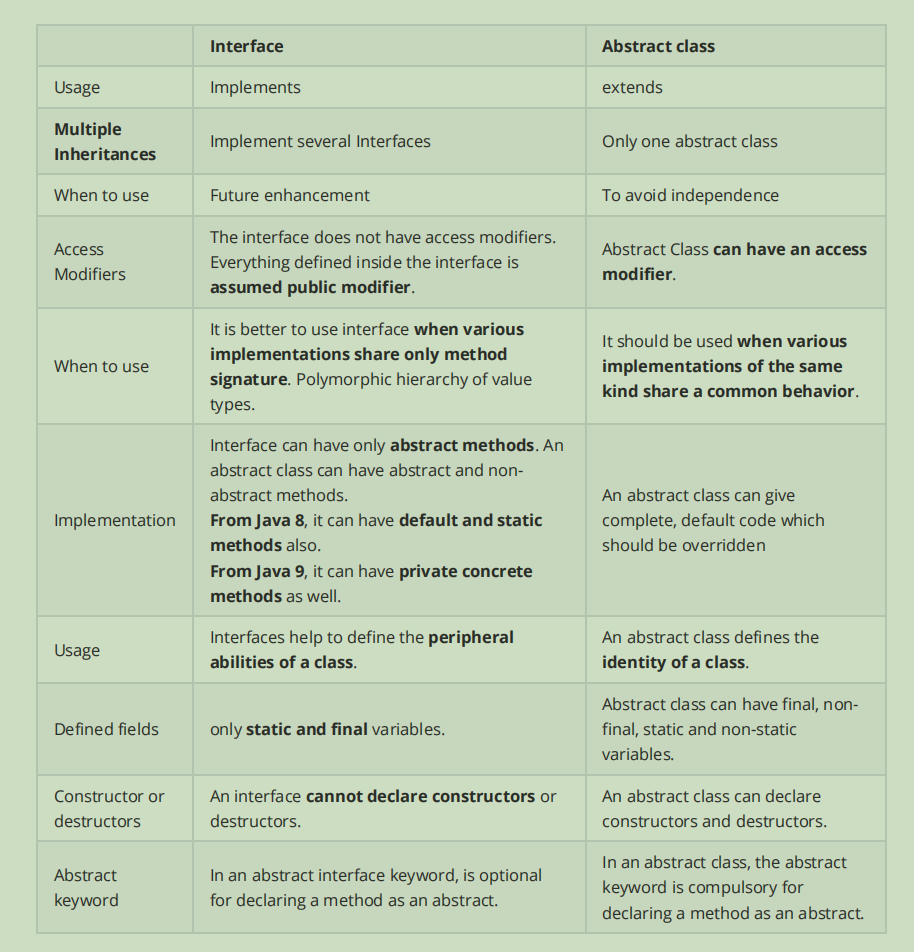

# Week 1 Day 2


### 1.demonstrate the three foundmental concepts of OOP

Write up Example code to demonstrate the three foundmental concepts of OOP. (reference **Code Demo**

**repo** as example)

- Encapsulation

  Good Example:

  ```java
  package Q1.Encapsulation;
  
  public class UserAccountGood {
      private String username;
      private double balance;
  
      public UserAccountGood(String username, double balance) {
          this.username = username;
          this.balance = balance;
      }
      public String getUsername() {
          return username;
      }
  
      public double getBalance() {
          return balance;
      }
  
      public void setBalance(double balance) {
          this.balance = balance;
      }
  
      public void setUsername(String username) {
          this.username = username;
      }
  }
  ```

  Bad Example:

  ```java
  package Q1.Encapsulation;
  
  public class UserAccountBad {
      public String username;
      public double balance;
  
      public UserAccountBad(String username, double balance) {
          this.username = username;
          this.balance = balance;
      }
  }
  ```

  Test:

  ```java
  package Q1.Encapsulation;
  
  public class EncTest {
      public static void main(String[] args) {
          UserAccountBad bad = new UserAccountBad("bad", 0.0);
          UserAccountGood good = new UserAccountGood("good", 0.0);
  
          bad.username = "bad2";
          bad.balance = 100.0;
  
          good.setUsername("good2");
          good.setBalance(100.0);
  
          System.out.println(bad.username);
          System.out.println(bad.balance);
  
          System.out.println(good.getUsername());
          System.out.println(good.getBalance());
      }
  }
  ```

  Encapsulation hide the internal details of the object, form the data and behavior into units and provide APIs. But in bad example key attribution are marked as public, which makes this attribute can be modified by code out of the class.

- Polymorphism

  ```java
  package Q1.Polymorphism;
  
  public abstract class Animal {
      public void makeSound() {
          System.out.println("The animal makes a sound.");
      }
  
      public void makeSound(String sound){
          System.out.println("The animal makes a sound: " + sound);
      }
  }
  
  class Dog extends Animal {
      @Override
      public void makeSound() {
          System.out.println("The dog barks.");
      }
  }
  
  class Cat extends Animal {
      @Override
      public void makeSound() {
          System.out.println("The cat meows.");
      }
  }
  ```

  In this example, Override is implementd by building specific method in sub classes ,which is inherited from spuer class. Overloading is realized by building two makeSound methods with different parameter list in one class.

- Inheritance

  ```java
  package Q1.Inheritance;
  
  public class Animal {
      protected String name;
  
      public Animal(String name) {
          this.name = name;
      }
  
      public void eat() {
          System.out.println(name + " is eating.");
      }
  }
  
  class Mammal extends Animal {
      public Mammal(String name) {
          super(name);
      }
  
      public void walk() {
          System.out.println(name + " is walking.");
      }
  }
  
  class Dog extends Mammal {
      public Dog(String name) {
          super(name);
      }
  
      public void bark() {
          System.out.println(name + " is barking.");
      }
  }
  ```

  In this example, Dog extend Mammal, Mammal extends Animal. This is multilayer inheritence.

2. wrapper class

What is **wrapper class** in Java and Why we need wrapper class?

A class that provides a way to use primitive data types as objects. Byte Short Integer Long Float Double Boolean Character.

Wrapper class can converting between primitive data types and objects and can store primitive data types in collections. Wrapper classes provide utility methods for working with primitive data types like `parseInt()`. In addition it provides a way to handle null values.

### 3.difference between **HashMap** and **HashTable**

What is the difference between **HashMap** and **HashTable**?

- Hashtable is synchronized, which means that multiple threads cannot access a Hashtable object at the same time. HashMap is not synchronized. Because Hashtable is synchronized, its performance can be slower than HashMap especially in multiple-thread situations
- Hashtable does not allow null keys or null values, while HashMap allows one null key and multiple null values.
- Hashtable use fail-safe enumerator. It does not throw an exception if the map is modified during iteration. Instead, it makes a copy of the map and iterates over the copy. For hashMap, the iterator is fail-fast, which means that it will throw a ConcurrentModificationException if the map is modified during iteration

### 4.String pool

What is **String pool** in Java and why we need String pool?

String pool is a special area of the heap memory where string literals are stored. Only string literals and strings that are explicitly added to the pool using `intern()` method are stored in the string pool. String objects created using `new` or the String constructor are not added to the string pool.

The string pool can optimize memory usage and performance, as it avoids creating multiple instances of the same string literal. And strings that have the same value can be compared using reference rather than specific object value.

### 5.garbage collection

What is Java **garbage collection**?

Java's automatic memory management system, which automatically identifies and removes objects that are no longer being used by the application

The Java Virtual Machine (JVM) automatically performs garbage collection in the background, periodically identifying and removing objects that are no longer referenced by any part of the program. The JVM uses several algorithms to determine which objects are no longer needed, including mark-and-sweep, copying, and generational collection.

### 6.access modifiers

What are **access modifiers** and their scopes in Java?

They can decorate class, method, or field.

- Public: can be accessed from anywhere in the program, regardless of its location or package.
- Protected: can be accessed from within the same package or from a subclass in a different package.
- Default (Package-private): class, method, or field with no access modifier (no public, protected, or private keyword) can only be accessed from within the same package(defined in the same directory or a subdirectory of the same directory).
- Private: can only be accessed from within the same class.

7.final

What is **final** key word? (Filed, Method, Class)

- A final field is a constant value that cannot be changed once it is initialized. It must be initialized either at the time of declaration or in the constructor.

- A final method is a method that cannot be overridden by a subclass. 
- A final class is a class that cannot be extended by any subclass. The `String` class in Java is final

### 8.static

What is **static** keyword? (Filed, Method, Class). When do we usually use it?

`static` can be applied to fields, methods, and classes to indicate that they belong to the class itself rather than an instance of the class

- A static field is a field that belongs to the class itself rather than an instance of the class.
- A static method is a method that belongs to the class itself rather than an instance of the class.
- A static class can be used to group related methods or classes that do not need to access the instance variables of the enclosing class. It can also be used to create utility classes that contain only static methods and do not need to be instantiated.

The "static" keyword in Java is used to create class-level variables or methods that are independent of any particular instance of the class. This can be useful for creating utility methods that perform a common task, or for defining constants or configuration values that should be shared across all instances of a class.

### 9.overriding and overloading

What is the differences between overriding and overloading?

Overloading refers to the ability to create multiple methods with the same name but different parameters in the same class. Java uses the parameters' types and order to determine which method to call instead of return type.

Overriding refers to the ability to define a method in a subclass with the same signature as a method in its superclass. The subclass method must have the same name, return type, and parameters as the superclass method. 


Overloading is typically used to provide alternative ways to perform the same operation with different inputs.

Overriding is typically used to provide a specific implementation of a method for a subclass, while inheriting the other methods and properties of the superclass.

### 10.super and this

What is the differences between **super** and **this**?

The `this` keyword is used to refer to the current object while the `super` keyword is used to refer to the superclass of the current object. `this` can only access instance variables and methods of the current object, while `super` can access both instance and static variables and methods of the superclass.

### 11.load sequence

What is the Java **load sequence**?

In general: Loading: The Java Virtual Machine (JVM) loads a class file into memory when it is first referenced by another class in the running application -> Linking: After a class is loaded, it is linked, which involves verifying the correctness of the bytecode, allocating static memory for the class's variables and methods, and resolving any references to other classes that are used by the class. -> Initialization: 

1. The superclass is loaded and initialized first.
2. The static fields and static blocks of the current class are then initialized in the order in which they appear in the code.
3. The instance variables and instance blocks of the current class are initialized in the order in which they appear in the code.
4. The constructor of the current class is then called.

When a class is loaded, all its static fields and static blocks are initialized before any of its instance variables or constructors are called. 

### 12.Polymorphism

What is Polymorphism ? And how Java implements it ?

Polymorphism allows objects to take on multiple forms or behaviors based on the context in which they are used. In Java, polymorphism is achieved through two mechanisms: method overloading and method overriding.

### 13.Encapsulation

What is **Encapsulation** ? How Java implements it? And why we need encapsulation?

1. Encapsulation refers to the practice of hiding internal details of an object and exposing only what is necessary to interact with it.
2. Encapsulation is implemented using access modifiers such as private, public, and protected.
3. Encapsulation is important because it allows for the creation of more secure and robust code. By hiding the internal details of an object, it becomes easier to modify the implementation of a class without affecting the other parts of the code that depend on it. Encapsulation also helps to prevent unauthorized access to the internal details of an object, which can lead to bugs and security vulnerabilities.

### 14.Interface and abstract

What is **Interface** and what is **abstract** class? What are the differences between them?

An interface is a collection of abstract methods that define a contract for classes that implement it, whereas an abstract class is a class that may have abstract methods and can be used as a superclass for other classes.



### 15.parking lot OOD

see `/coding1`

### 16.queue interface implementations

What are **Queue interface** implementations and what are the differences and when to use what?

1. LinkedList: doubly-linked list implementation of the Queue interface. It provides constant time for insertion and removal of elements at both ends of the queue. It is an unbounded queue, meaning it can grow indefinitely. It can grow indefinitely and has fast insertion and removal times from both ends.
2. ArrayDeque: a resizable array implementation of the Queue interface. It provides constant time for insertion and removal of elements at both ends of the queue. It is an unbounded queue and can grow indefinitely. It can grow indefinitely and has fast insertion and removal times from both ends and has better performance for large queues than LinkedList.
3. PriorityQueue: that provides ordering based on the elements' natural ordering or a Comparator. It is an unbounded queue and can grow indefinitely. It can order elements based on natural ordering or a Comparator
