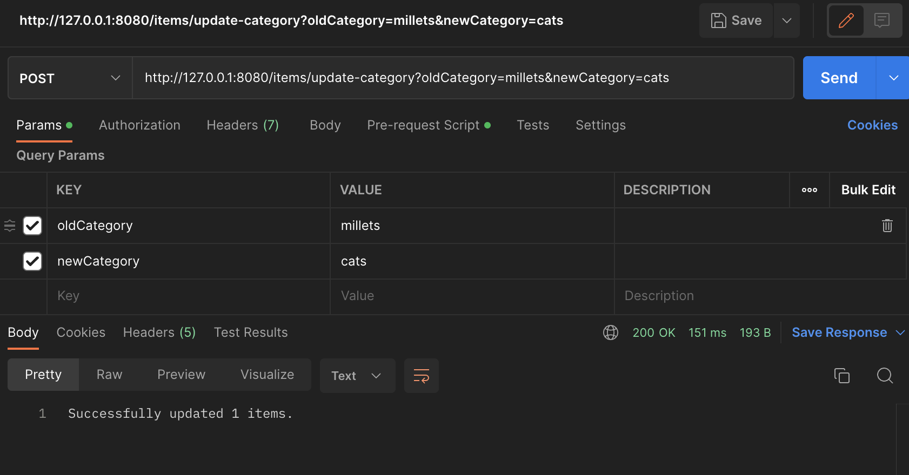

2. explain how the below annotaitons specify the table in database?

   ```java
   @Column(columnDefinition = "varchar(255) default 'John Snow'")
   private String name;
   @Column(name="STUDENT_NAME", length=50, nullable=false, unique=false)
   private String studentName; 
   ```

   These annotations are used to specify the properties of the corresponding columns in the database table. `@Column` annotation is used to specify the name, type, and constraints of a column. The `columnDefinition` attribute is used to specify the column's data type and default value. The `name` attribute is used to specify the column name in the table. The `length` attribute specifies the maximum length of a column, `nullable` attribute specifies whether a column can be null or not, and `unique` attribute specifies whether a column value should be unique or not.

3. What is the default column names of the table in database for `@Column`?

   ```java
   @Column
   private String firstName;
   
   @Column
   private String operatingSystem;
   ```

   Since the `@Column` annotation without any attributes, the default column name in the database will be the same as the field name in the Java class.

4. What are the **layers** in springboot application? what is the **role** of each layer?

   1. **Controller layer:** This layer handles incoming HTTP requests, processes them, and returns a response. It is responsible for handling user input and sending the response back to the user.
   2. **Service layer:** This layer contains the business logic of the application. It is responsible for implementing the use cases defined by the application and coordinating the interactions between different components.
   3. **Repository layer:** This layer is responsible for interacting with the database or other persistent storage mechanism. It is responsible for querying, inserting, updating, and deleting data.
   4. **Model layer:** This layer defines the domain model or the business objects used in the application. It represents the data and the relationships between different entities.

5. Describe the **flow in all of the layers** if an API is called by Postman.

   1. Request handling starts with the Controller layer, which receives the HTTP request and maps it to a specific method.
   2. The Controller layer then passes the request to the Service layer, where the actual business logic is executed. This includes data validation, processing, and persistence.
   3. The Service layer interacts with the Persistence layer, which is responsible for accessing and manipulating the data stored in the database.
   4. Once the data has been processed and manipulated as required, the results are returned to the Service layer, which prepares the response and sends it back to the Controller layer.
   5. The Controller layer then returns the response to the client through the appropriate HTTP status code and response body.
   6. If an error occurs at any point in the flow, it is caught by the Exception Handling layer, which returns an appropriate error message and status code to the client.

6. What is the **application.properties**? do you know **application.yml**?

   `application.properties` and `application.yml` are configuration files in Spring Boot used to configure the application's properties. They are located in the `src/main/resources` directory of the project. Both `application.properties` and `application.yml` can be used interchangeably to configure the Spring Boot application, depending on personal preference or project requirements.

   `application.properties` is a file that uses a key-value pair syntax to define application settings, such as server port, database configuration, logging settings, and others. For example:

   ```xml
   server.port=8080
   spring.datasource.url=jdbc:mysql://localhost:3306/mydb
   logging.level.root=info
   ```

   `application.yml` is a file that uses a YAML syntax to define application settings. It provides a more human-readable format and supports hierarchy and list-based configuration. Here's an example:

   ```yml
   server:
     port: 8080
   spring:
     datasource:
       url: jdbc:mysql://localhost:3306/mydb
   logging:
     level:
       root: info
   ```

7. Create a Project, name it with **mongo-blog**, write a **POST API** for mongo-blog, change database to

**MongoDB**;

- https://www.mongodb.com/compatibility/spring-boot



8. In your **redbook** application, write the code for **RUD** APIs.
   1. https://github.com/TAIsRich/springboot-redbook.git
      - Branch: **02_post_RUD**
   2. you need to call the new APIs in your postman.
   3. You need to type it line by line and try your best to understand it. **DO NOT COPY PASTE**