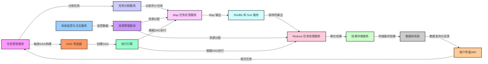

```mermaid
graph LR
    A[任务管理服务] -->|分割任务| B[任务分割服务]
    B -->|分割的小任务| C[Map 任务处理服务]
    C -->|Map 输出| D[Shuffle 和 Sort 服务]
    D -->|排序的输出| E[Reduce 任务处理服务]
    E -->|聚合结果| F[结果存储服务]
    F -->|存储最终结果| G[数据库系统]

    H[用户界面/API] -->|提交任务| A
    I[系统监控与日志服务] -->|监控数据| J[资源管理服务]
    J -->|资源分配| C
    J -->|资源分配| E

    K[DAG 构造器] -->|创建DAG| L[执行引擎]
    A -->|触发DAG构建| K
    L -->|根据DAG执行| C
    L -->|根据DAG执行| E

    G -->|数据查询与反馈| H

    style A fill:#f9f,stroke:#333,stroke-width:2px
    style B fill:#ccf,stroke:#333,stroke-width:2px
    style C fill:#fcf,stroke:#333,stroke-width:2px
    style D fill:#cff,stroke:#333,stroke-width:2px
    style E fill:#fcd,stroke:#333,stroke-width:2px
    style F fill:#cfc,stroke:#333,stroke-width:2px
    style G fill:#ccc,stroke:#333,stroke-width:2px
    style H fill:#fc9,stroke:#333,stroke-width:2px
    style I fill:#9cf,stroke:#333,stroke-width:2px
    style J fill:#c9f,stroke:#333,stroke-width:2px
    style K fill:#f96,stroke:#333,stroke-width:2px
    style L fill:#9fc,stroke:#333,stroke-width:2px
```
